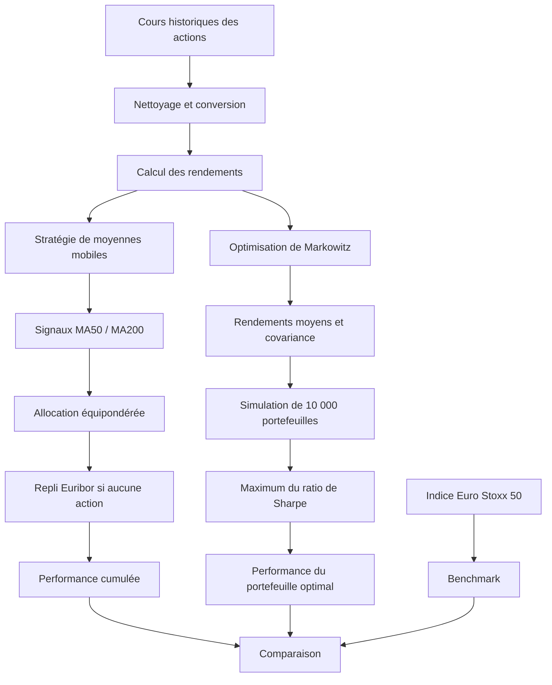

# Stratégies quantitatives d’investissement sur l’Euro Stoxx 50

<p align="center">
  
</p>


Projet académique de finance quantitative consacré à la conception, au backtesting et à la comparaison de deux stratégies systématiques d’investissement appliquées aux actions composant l’Euro Stoxx 50.

Les deux approches étudiées sont :

1. une stratégie de suivi de tendance fondée sur le croisement de moyennes mobiles ;
2. une stratégie d’allocation reposant sur l’optimisation moyenne-variance de Markowitz.

L’objectif est de transformer des historiques de prix en décisions d’investissement reproductibles, puis de comparer les performances obtenues à celles de l’indice Euro Stoxx 50.

> Projet réalisé par Benjamin Baillet et Yannick Djeigo dans le cadre du Master IREF — Finance Quantitative et Actuariat de l’Université de Bordeaux.

---

## Sommaire

- [Contexte](#contexte)
- [Problématique](#problématique)
- [Objectifs](#objectifs)
- [Données](#données)
- [Architecture du projet](#architecture-du-projet)
- [Préparation des données](#préparation-des-données)
- [Stratégie 1 — Moyennes mobiles](#stratégie-1--moyennes-mobiles)
- [Allocation du portefeuille](#allocation-du-portefeuille)
- [Utilisation de l’Euribor](#utilisation-de-leuribor)
- [Backtesting 2019-2022](#backtesting-2019-2022)
- [Simulation sur 2023](#simulation-sur-2023)
- [Stratégie 2 — Markowitz](#stratégie-2--markowitz)
- [Simulation Monte-Carlo](#simulation-monte-carlo)
- [Résultats](#résultats)
- [Comparaison des stratégies](#comparaison-des-stratégies)
- [Technologies utilisées](#technologies-utilisées)
- [Compétences démontrées](#compétences-démontrées)
- [Limites](#limites)
- [Pistes d’amélioration](#pistes-damélioration)
- [Auteurs](#auteurs)

---

# Contexte

Les stratégies quantitatives utilisent des règles mathématiques et informatiques pour transformer des données financières en décisions d’investissement.

Elles permettent notamment de :

- réduire la part de subjectivité ;
- automatiser la sélection des titres ;
- appliquer des règles identiques dans le temps ;
- mesurer précisément les performances ;
- comparer plusieurs méthodes d’allocation ;
- contrôler le risque de manière systématique.

Ce projet étudie deux approches classiques.

## Suivi de tendance

La stratégie de moyennes mobiles cherche à détecter les tendances haussières et baissières à partir de l’historique des prix.

## Diversification moyenne-variance

La méthode de Markowitz cherche à sélectionner les pondérations offrant le meilleur compromis entre rendement attendu et volatilité.

---

# Problématique

Le projet répond à la question suivante :

> Comment construire en Python une stratégie d’investissement reproductible qui détecte les tendances, répartit le capital entre les actions sélectionnées et améliore le couple rendement-risque par rapport à un investissement passif dans l’Euro Stoxx 50 ?

La méthodologie doit permettre de :

- lire et nettoyer les données financières ;
- générer des signaux d’investissement ;
- calculer les allocations ;
- simuler la performance du portefeuille ;
- comparer le résultat à un benchmark ;
- analyser le rendement et le risque ;
- identifier les limites méthodologiques.

---

# Objectifs

Les principaux objectifs sont :

1. automatiser l’import et le nettoyage des données ;
2. calculer les rendements quotidiens ;
3. générer des signaux avec des moyennes mobiles ;
4. répartir le capital entre les actions sélectionnées ;
5. utiliser l’Euribor lorsque la stratégie ne sélectionne aucune action ;
6. backtester la stratégie entre 2019 et 2022 ;
7. examiner son comportement en 2023 ;
8. comparer les performances à l’Euro Stoxx 50 ;
9. simuler 10 000 portefeuilles de Markowitz ;
10. sélectionner le portefeuille possédant le meilleur ratio de Sharpe ;
11. comparer les deux logiques d’investissement ;
12. analyser les limites et les améliorations possibles.

---

# Données

Le projet repose sur trois fichiers CSV.

## Composition de l’Euro Stoxx 50

```text
donnees/compo_eurostoxx_data.csv
```

Ce fichier contient les cours historiques quotidiens des actions étudiées.

Caractéristiques du fichier fourni :

```text
Période : 31 décembre 2018 au 13 décembre 2023
Nombre d’observations : 1 292
Nombre de séries d’actions : 44
```

Les données sont utilisées pour :

- calculer les rendements ;
- calculer les moyennes mobiles ;
- construire les matrices de covariance ;
- générer les allocations ;
- évaluer les stratégies.

## Indice Euro Stoxx 50

```text
donnees/eurostoxx50_data.csv
```

Ce fichier contient l’historique du SX5E.

Il sert de benchmark pour comparer les stratégies à un investissement passif dans l’indice.

## Euribor 6 mois

```text
donnees/euribor6M_data.csv
```

L’Euribor 6 mois est utilisé comme approximation d’un placement de repli lorsque la stratégie de moyennes mobiles ne sélectionne aucune action.

---

# Préparation des données

## Lecture des CSV

Les fichiers utilisent :

- le point-virgule comme séparateur ;
- la virgule comme séparateur décimal ;
- le format de date français.

Exemple :

```python
df = pd.read_csv(
    "../donnees/compo_eurostoxx_data.csv",
    sep=";",
    index_col="Date",
    parse_dates=["Date"],
    date_format="%d/%m/%Y"
)
```

## Conversion des valeurs

Les nombres sont initialement stockés sous forme de chaînes de caractères.

```python
df = df.apply(
    lambda colonne: colonne.apply(
        lambda valeur: pd.to_numeric(
            valeur.replace(",", "."),
            errors="coerce"
        )
    )
    if colonne.dtype == "object"
    else colonne
)
```

## Calcul des rendements

Les rendements simples quotidiens sont calculés avec :

```python
daily_returns = df.pct_change().dropna()
```

La performance cumulée est calculée avec :

```python
cumulative_return = (
    1 + daily_returns
).cumprod() * 100
```

Une base 100 est utilisée afin de faciliter la comparaison des trajectoires.

---

# Architecture du projet



---

# Stratégie 1 — Moyennes mobiles

## Principe

La stratégie utilise deux moyennes mobiles :

```text
Moyenne mobile courte : 50 jours
Moyenne mobile longue : 200 jours
```

La moyenne mobile à la date \(t\) est :

```math
MM_n(t)
=
\frac{1}{n}
\sum_{i=0}^{n-1}
P_{t-i}
```

avec :

- \(P_t\) : prix de l’action à la date \(t\) ;
- \(n\) : longueur de la fenêtre.

## Signal d’achat

```text
MA50 > MA200
```

La tendance est considérée comme haussière et l’action est sélectionnée.

## Signal de sortie

```text
MA50 ≤ MA200
```

L’action n’est pas retenue dans le portefeuille.

## Calcul Python

```python
short_window = 50
long_window = 200

short_ma = prices.rolling(
    window=short_window
).mean()

long_ma = prices.rolling(
    window=long_window
).mean()

signals = (
    short_ma > long_ma
).astype(int)
```

Les 200 premières observations sont exclues de l’analyse car la moyenne mobile longue n’est pas encore entièrement disponible.

---

# Allocation du portefeuille

À chaque date, le capital est réparti de manière équipondérée entre les actions sélectionnées.

Avec \(N_t\) actions sélectionnées à la date \(t\) :

```math
w_{i,t}
=
\frac{1}{N_t}
```

pour chaque action retenue.

En Python :

```python
weights = signals.apply(
    lambda ligne:
        ligne / ligne.sum()
        if ligne.sum() > 0
        else ligne,
    axis=1
)
```

Cette allocation présente plusieurs avantages :

- simplicité ;
- absence de concentration volontaire ;
- faible nombre de paramètres ;
- facilité d’interprétation.

Elle ne tient cependant pas compte de la volatilité individuelle des titres.

---

# Utilisation de l’Euribor

Il existe des périodes pendant lesquelles aucune action ne vérifie :

```text
MA50 > MA200
```

Dans ce cas, le portefeuille est placé à 100 % sur l’actif de repli représenté par l’Euribor 6 mois.

```python
df_check["EUR006M Index"] = df_check[
    "NB_POS"
].apply(
    lambda nombre:
        0 if nombre > 0
        else 1
)
```

Le taux annuel doit être converti en rendement quotidien :

```python
daily_euribor = euribor[
    "EUR006M Index"
].apply(
    lambda taux:
        (1 + taux / 100) ** (1 / 365) - 1
)
```

Cette règle limite l’exposition aux actions lorsque les signaux deviennent globalement défavorables.

---

# Calcul de la performance

La contribution de chaque actif est :

```math
Contribution_{i,t}
=
w_{i,t}
\times
r_{i,t}
```

Le rendement quotidien de la stratégie est :

```math
r_{portefeuille,t}
=
\sum_i
w_{i,t}r_{i,t}
```

En Python :

```python
strategy_returns = (
    final_returns * weights
).fillna(0)

strategy_returns = strategy_returns.sum(
    axis=1
)
```

La performance cumulée est :

```python
cumulative_return = pd.DataFrame(
    (1 + strategy_returns).cumprod() * 100,
    columns=["Moyennes mobiles"]
)
```

---

# Backtesting 2019-2022

La période principale de backtesting est :

```text
31 décembre 2018 au 30 décembre 2022
```

La stratégie est comparée au SX5E sur une base 100.

## Principales observations

- la stratégie sous-performe initialement l’indice ;
- elle est affectée par le choc de marché de 2020 ;
- elle dépasse le benchmark à partir d’environ mai 2020 ;
- elle conserve globalement cet avantage jusqu’à la fin du backtest ;
- elle récupère plus rapidement après certaines phases de baisse.

La stratégie semble donc mieux fonctionner lorsque les tendances sont suffisamment longues et clairement identifiables.

---

# Simulation sur 2023

Afin de disposer des 200 observations nécessaires au calcul de la moyenne longue, la simulation 2023 utilise également une partie de l’historique de 2022.

```python
date_debut = "2022-03-25"
df_simulation = df.loc[date_debut:]
```

L’évaluation porte ensuite sur l’année 2023.

## Observations

- la stratégie reste proche de l’Euro Stoxx 50 ;
- elle sous-performe légèrement au début de l’année ;
- elle limite mieux certaines phases de baisse ;
- elle termine légèrement au-dessus du benchmark dans l’analyse présentée.

Cette performance doit être complétée par des mesures de risque avant de pouvoir conclure à une supériorité durable.

---

# Stratégie 2 — Markowitz

## Principe

La théorie moderne du portefeuille cherche à sélectionner les poids offrant le meilleur compromis entre rendement attendu et risque.

## Rendement attendu

```math
E(R_p)
=
\sum_{i=1}^{n}
w_i E(R_i)
```

## Variance du portefeuille

```math
\sigma_p^2
=
w^\top \Sigma w
```

avec :

- \(w\) : vecteur des poids ;
- \(\Sigma\) : matrice de covariance ;
- \(\sigma_p\) : volatilité du portefeuille.

## Contraintes

Les portefeuilles simulés vérifient :

```math
\sum_i w_i = 1
```

et :

```math
w_i \geq 0
```

Les ventes à découvert ne sont donc pas autorisées.

---

# Simulation Monte-Carlo

Le projet simule :

```text
10 000 portefeuilles
```

Pour chaque portefeuille :

1. des poids aléatoires positifs sont générés ;
2. leur somme est normalisée à 100 % ;
3. le rendement attendu est calculé ;
4. la volatilité est calculée ;
5. le ratio de Sharpe est déterminé.

```python
number_of_portfolios = 10_000

for _ in range(number_of_portfolios):

    weights = np.random.random(
        len(returns.columns)
    )

    weights /= np.sum(weights)

    annual_return = np.sum(
        weights * mean_returns
    ) * 252

    annual_volatility = np.sqrt(
        np.dot(
            weights.T,
            np.dot(covariance_matrix, weights)
        )
    ) * np.sqrt(252)

    sharpe_ratio = (
        annual_return - risk_free_rate
    ) / annual_volatility
```

Le portefeuille retenu est celui qui maximise le ratio de Sharpe.

---

# Ratio de Sharpe

Le ratio de Sharpe mesure le rendement excédentaire par unité de risque :

```math
Sharpe
=
\frac{
E(R_p)-R_f
}{
\sigma_p
}
```

avec :

- \(E(R_p)\) : rendement attendu du portefeuille ;
- \(R_f\) : taux sans risque ;
- \(\sigma_p\) : volatilité.

Un ratio plus élevé indique un meilleur rendement ajusté au risque dans le cadre des hypothèses utilisées.

---

# Frontière rendement-risque

Les 10 000 portefeuilles sont représentés dans un nuage de points :

- axe horizontal : volatilité ;
- axe vertical : rendement attendu ;
- couleur : ratio de Sharpe.

Le portefeuille optimal est mis en évidence avec une étoile.

```python
plt.scatter(
    portfolio_volatility,
    portfolio_returns,
    c=portfolio_sharpe_ratios,
    cmap="viridis"
)

plt.colorbar(
    label="Ratio de Sharpe"
)

plt.scatter(
    optimal_volatility,
    optimal_return,
    marker="*",
    s=200
)
```

---

# Résultats

## Moyennes mobiles

La stratégie présente :

- une sous-performance initiale ;
- une meilleure récupération après le choc de 2020 ;
- une surperformance à partir d’environ mai 2020 ;
- une trajectoire proche du benchmark en 2023 ;
- une légère avance finale dans l’analyse présentée.

## Markowitz — 2019-2022

Le portefeuille sélectionné surpasse globalement l’Euro Stoxx 50 sur la période étudiée.

Une sous-performance est toutefois observée pendant une partie de l’année 2020.

## Markowitz — analyse 2023

L’analyse réalisée sur les données de 2023 obtient environ :

| Portefeuille | Rendement cumulé |
|---|---:|
| Portefeuille Markowitz | Environ 18 % |
| Euro Stoxx 50 | Environ 17,5 % |

Ce résultat doit être interprété avec prudence, car les poids sont estimés et évalués sur les mêmes données de 2023.

Il s’agit donc d’une analyse rétrospective et non d’un véritable test hors échantillon.

---

# Comparaison des stratégies

| Critère | Moyennes mobiles | Markowitz |
|---|---|---|
| Logique | Suivi de tendance | Optimisation rendement-risque |
| Signal | MA50 supérieure à MA200 | Maximum du ratio de Sharpe |
| Allocation | Équipondération | Poids optimisés |
| Repli | Euribor 6 mois | Aucun repli spécifique |
| Diversification | Indirecte | Centrale dans le modèle |
| Complexité | Faible | Moyenne |
| Interprétabilité | Très élevée | Élevée |
| Sensibilité | Fenêtres choisies | Rendements et covariances estimés |
| Risque principal | Faux signaux | Instabilité des poids |
| Validation nécessaire | Sensibilité des fenêtres | Test hors échantillon |

Les deux stratégies répondent à des objectifs différents.

La stratégie de moyennes mobiles cherche principalement à éviter les tendances baissières.

Markowitz cherche à optimiser la combinaison des actifs selon leurs rendements et leurs corrélations historiques.

---

# Technologies utilisées

## Python

Utilisé pour :

- automatiser la stratégie ;
- manipuler les données ;
- calculer les performances ;
- simuler les portefeuilles.

## Pandas

Utilisé pour :

- charger les CSV ;
- convertir les valeurs ;
- aligner les dates ;
- calculer les rendements ;
- réaliser les jointures ;
- exporter les résultats.

## NumPy

Utilisé pour :

- générer les poids aléatoires ;
- calculer les produits matriciels ;
- déterminer la volatilité ;
- simuler les portefeuilles.

## Matplotlib

Utilisé pour représenter :

- les prix ;
- les moyennes mobiles ;
- les signaux d’achat et de sortie ;
- les performances cumulées ;
- le nuage rendement-risque ;
- le portefeuille optimal.

---

# Compétences démontrées

## Python

- Pandas ;
- NumPy ;
- Matplotlib ;
- notebooks Jupyter ;
- fonctions vectorisées ;
- traitement des dates ;
- export de résultats.

## Finance quantitative

- rendements financiers ;
- performance cumulée ;
- moyennes mobiles ;
- ratio de Sharpe ;
- volatilité ;
- covariance ;
- allocation d’actifs ;
- théorie de Markowitz.

## Backtesting

- règles d’investissement ;
- génération de signaux ;
- pondérations quotidiennes ;
- benchmark ;
- périodes d’apprentissage ;
- analyse historique ;
- validation hors échantillon.

## Data Analysis

- importation de données ;
- conversion de formats ;
- alignement temporel ;
- contrôle des types ;
- visualisation ;
- comparaison de séries.

## Analyse critique

- identification des biais ;
- limites du backtesting ;
- sensibilité des paramètres ;
- compromis rendement-risque ;
- distinction entre analyse rétrospective et prédictive.

---

# Limites

- Les coûts de transaction ne sont pas intégrés.
- Le slippage n’est pas pris en compte.
- Les dividendes ne sont pas explicitement modélisés.
- Les taxes ne sont pas intégrées.
- Les poids sont supposés parfaitement exécutables.
- L’allocation de moyennes mobiles est uniquement équipondérée.
- Les fenêtres 50 et 200 jours ne font pas l’objet d’une optimisation ou d’une analyse de sensibilité.
- La stratégie peut produire de faux signaux lorsque le marché évolue sans tendance claire.
- L’Euribor constitue seulement une approximation d’un placement sans risque.
- Les unités de l’Euribor doivent être vérifiées avant sa conversion en rendement quotidien.
- La composition de l’indice utilisée doit être contrôlée afin d’éviter un éventuel biais de survivance.
- Markowitz est sensible aux erreurs d’estimation des rendements moyens.
- Les poids optimaux peuvent être instables.
- La matrice de covariance historique peut mal représenter les risques futurs.
- L’analyse Markowitz 2023 utilise les données de 2023 pour l’estimation et l’évaluation.
- Le projet ne réalise pas encore de backtest glissant.
- Le drawdown maximal n’est pas calculé.
- Les résultats ne constituent pas une garantie de performance future.

---

# Pistes d’amélioration

- intégrer les coûts de transaction ;
- ajouter le slippage ;
- intégrer les dividendes ;
- calculer la volatilité annualisée ;
- calculer le ratio de Sharpe annualisé ;
- mesurer le drawdown maximal ;
- calculer le ratio de Sortino ;
- tester plusieurs couples de moyennes mobiles ;
- réaliser une analyse de sensibilité ;
- utiliser une validation walk-forward ;
- rééquilibrer Markowitz chaque mois ou chaque trimestre ;
- appliquer les poids estimés sur une période future ;
- comparer à un portefeuille équipondéré ;
- comparer à un portefeuille de variance minimale ;
- limiter le poids maximal par action ;
- utiliser une covariance régularisée ;
- utiliser le modèle Black-Litterman ;
- intégrer un ciblage de volatilité ;
- ajouter une stratégie momentum ;
- construire un tableau de bord interactif ;
- automatiser la mise à jour des données.

---

# Conclusion

Ce projet met en place une chaîne complète de finance quantitative :

```text
Données historiques
        ↓
Nettoyage et alignement
        ↓
Calcul des rendements
        ↓
Création des stratégies
        ↓
Allocation du capital
        ↓
Backtesting
        ↓
Comparaison au benchmark
        ↓
Analyse critique
```

La stratégie de moyennes mobiles montre qu’une règle simple et interprétable peut capter les tendances durables et limiter certaines phases baissières.

La méthode de Markowitz introduit une logique plus explicite de diversification et d’optimisation du rendement ajusté au risque.

Les résultats historiques sont encourageants, mais une version professionnalisée nécessiterait :

- une validation hors échantillon ;
- un backtest glissant ;
- des coûts de marché réalistes ;
- des métriques de risque complémentaires ;
- des contraintes d’allocation.

---


# Auteurs

Projet réalisé par :

- Benjamin Baillet ;
- Yannick Djeigo.

Établissement :

```text
Université de Bordeaux
Master IREF — Finance Quantitative et Actuariat
```

## Benjamin Baillet

Compétences principales :

- Python ;
- Pandas ;
- NumPy ;
- finance quantitative ;
- séries temporelles ;
- backtesting ;
- allocation d’actifs ;
- SQL ;
- Power BI ;
- R.
